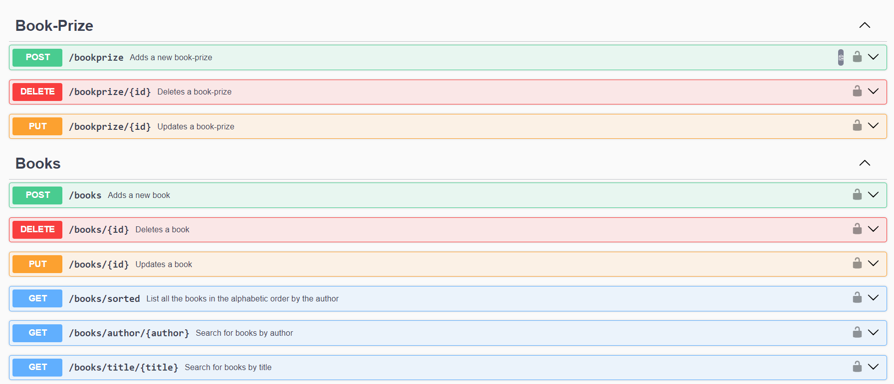
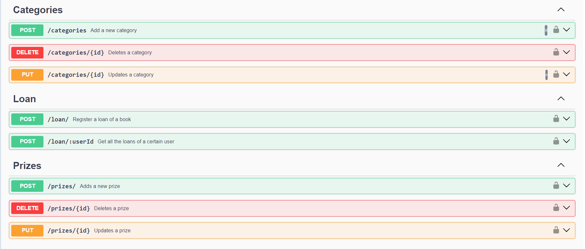
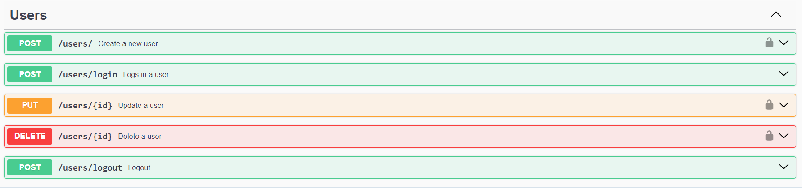

# Book Lending System

## Project Overview
This is an University project for my NodeJs class.

The Book Lending System is designed to facilitate the management and lending of books to users. It includes features such as user authentication, book browsing, and loan management. This system is ideal for libraries or any organization managing a collection of books.


## Technologies Used
- **Node.js**: Server-side JavaScript runtime.
- **Express.js**: Web application framework for Node.js.
- **Sequelize**: ORM to interact with databases like MySQL, PostgreSQL, etc.
- **Jest**: Testing framework for JavaScript.
- **SQLite/MySQL/PostgreSQL**: Databases supported.
- **Swagger**: API documentation tool.

## Getting Started

### Prerequisites
Before you begin, ensure you have the following installed:
- Node.js - [Download & Install Node.js](https://nodejs.org/en/download/)
- A package manager such as npm (comes with Node.js) or Yarn


## Installation

```bash
git clone [https://github.com/alinutz03/book-lending-system.git]
cd book-lending-system
npm install
```

## Configuration

### Environment
Create a .env file in the root directory of the project. This file should contain the following environment variables:
```
DB_NAME
DB_USER
DB_PASS
DB_HOST
JWT_SECRET
```

These variables are used to configure the database connection and JWT authentication:

DB_NAME: The name of your database. 

DB_USER: The username for your database.

DB_PASS: The password for your database.

DB_HOST: The host address for your database.

JWT_SECRET: A secret key for signing JSON Web Tokens (JWT).


### Database Configuration
```
require('dotenv').config();
const { Sequelize } = require('sequelize');


const sequelize = new Sequelize(
  process.env.DB_NAME,
  process.env.DB_USER,
  process.env.DB_PASS, {
    host: process.env.DB_HOST,
    dialect: 'mysql',
    logging: console.log
});


sequelize.authenticate()
  .then(() => {
    console.log('Connection has been established successfully.');
  })
  .catch(err => {
    console.error('Unable to connect to the database:', err);
  });

module.exports = sequelize;
```


### Features
- User authentication
- Book browsing by category
- Lending and returning books
- Managing book prizes and categories

## Workflow
Below are the workflow diagrams illustrating the user authentication and book lending processes:

### Book Lending Workflow


## Database Schema
The following diagram illustrates the database schema used in the Book Lending System:


## Swagger
To explain better the endpoints of the application I used Swagger. In order to setup this tool, we have to follow the following steps:

### Instalation
```npm install swagger-ui-express swagger-jsdoc```


### Configuration
```const swaggerJSDoc = require('swagger-jsdoc');

const swaggerDefinition = {
  openapi: '3.0.0',
  info: {
  title: 'book-lending-system',
  version: '1.0.0',
  description: 'University project',
  },
  };
  
  const options = {
  swaggerDefinition,
  apis: ['./routes/*.js'], // Path to the API routes in your Node.js application
  };
  
  const swaggerSpec = swaggerJSDoc(options);
  module.exports = swaggerSpec;
```






## Testing
In order to test the applicaction, I used Jest.

### Instalation
```
npm install --save-dev jest supertest
```

### Dependencies
In application.json, in the root of the project, there is necessar to add the following syntax:
```
"scripts": {
    "test": "jest"
  }
```
## Run tests
```
npm test
```
