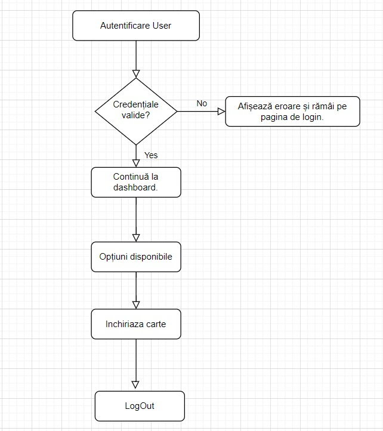
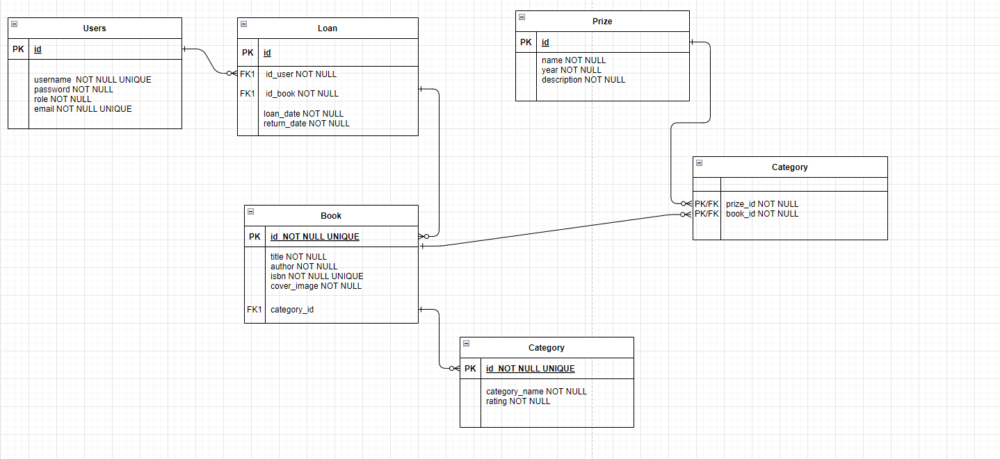

# Book Lending System

## Project Overview
This is an University project for my NodeJs class.
The Book Lending System is designed to facilitate the management and lending of books to users. It includes features such as user authentication, book browsing, and loan management. This system is ideal for libraries or any organization managing a collection of books.


## Installation

```bash
git clone [https://github.com/alinutz03/book-lending-system.git]
cd book-lending-system
npm install
```

### Features
- User authentication
- Book browsing by category
- Lending and returning books
- Managing book prizes and categories

## Workflow
Below are the workflow diagrams illustrating the user authentication and book lending processes:


### Book Lending Workflow


## Database Schema
The following diagram illustrates the database schema used in the Book Lending System:



